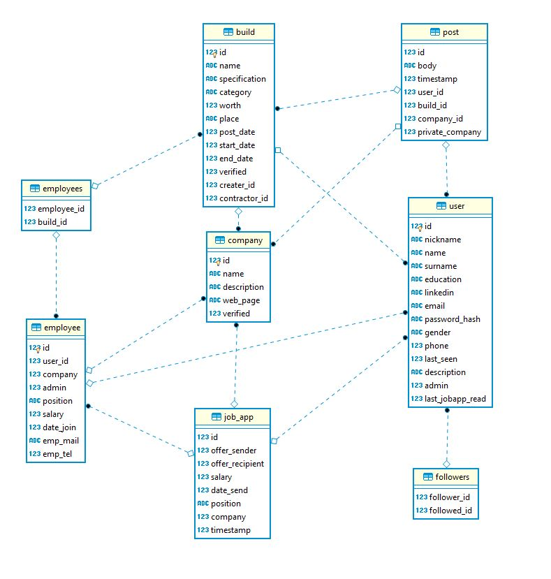

# Building-Control-App
With this app we can easy control Building and in faster way store raports and documentation.

I used bootstrap for frontend in aplication and python framework Flask for backend.
Check app progres on <a href='http://bulding-control-app.herokuapp.com/' target="_blank"> heroku </a>.

Database diagram

